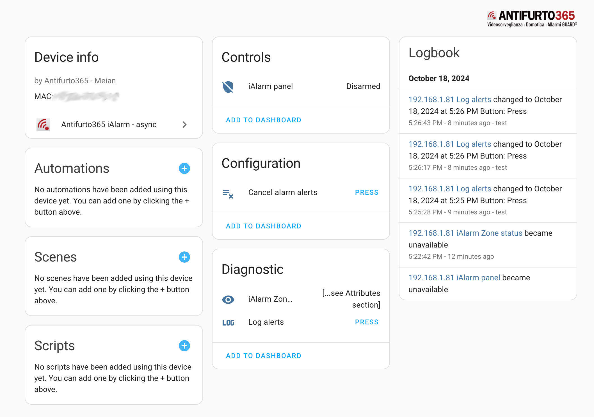
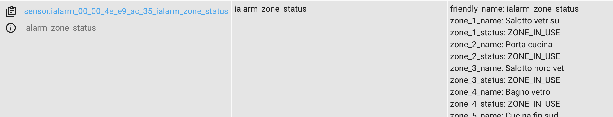
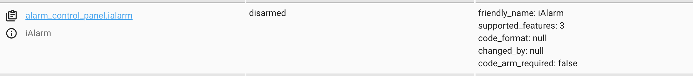
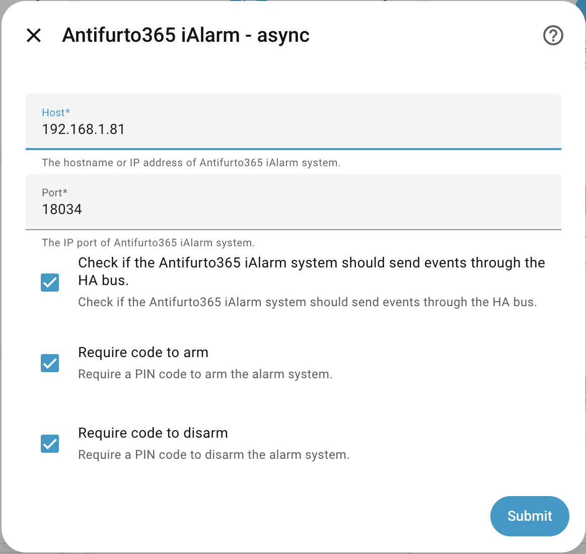

# IAlarm&trade; integration for homeassistant (unofficial)

[![GitHub Release][releases-shield]][releases]
![Project Stage][project-stage-shield]
[![License][license-shield]](LICENSE.md)

![Maintenance][maintenance-shield]
[![GitHub Activity][commits-shield]][commits]

[](https://www.buymeacoffee.com/bigmoby)


This is a platform to support IAlarm under alarm panel component of Home Assistant. The Python supporting library for accessing the IAlarm&trade; API is located at: https://github.com/bigmoby/ialarm_controller/

## Sample UI:





## Installation

### Manual

1. Create this directory path `custom_components/ialarm_controller/` if it does not already exist.

2. Download the all `custom_components/ialarm_controller/` files from the repo and place it in the directory mentioned in previous step.

### HACS

1. Add this repository to HACS:

```
https://github.com/bigmoby/ialarm_controller
```

2. Search for the `IAlarm integration for homeassistant` integration and choose install.

3. Reboot Home Assistant.

## Usage:

In Home Assistant->Settings->Device & services->Integration menu add the new integration IAlarm and configure it.



## UI Configuration

The iAlarm integration requires a code for both arming and disarming actions to ensure intentionality and security.

### Standard Alarm Panel Card

The easiest way to interact with your alarm is by using the standard `alarm-panel` card. Because the integration enforces a code requirement, the keypad will automatically appear.

```yaml
type: alarm-panel
entity: alarm_control_panel.ialarm_panel
states:
  - arm_home
  - arm_away
```

### Custom Button (Quick Arm)

If you want to create a button that arms the system with a specific code without typing it every time, you can use a manual service call:

```yaml
type: button
name: Quick Arm Away
icon: mdi:shield-lock
tap_action:
  action: call-service
  service: alarm_control_panel.alarm_arm_away
  target:
    entity_id: alarm_control_panel.ialarm_panel
  data:
    code: "1234"
```

## Custom Polling Interval (Advanced)

Home Assistant strongly discourages configuring the integration's scanning frequency (poll interval) directly from the integration's UI to maintain stability and comply with architectural guidelines. The iAlarm integration uses a pre-calibrated default `SCAN_INTERVAL`.

If you absolutely need to update the alarm status more frequently (or slower) than the default, you can do this safely using standard Home Assistant mechanisms:

1. Go to **Settings** -> **Devices & Services** -> **iAlarm**.
2. Click on the 3 dots (options) next to the integration and select **System Options**.
3. Toggle off **Enable polling for updates** (this stops the default continuous polling).
4. Create an **Automation** in Home Assistant that triggers exactly at your desired custom interval (e.g. `Time pattern` every 10 seconds).
5. In the Action of this automation, call the service **`homeassistant.update_entity`** and pick your `alarm_control_panel.ialarm_panel` entity.

```yaml
alias: "iAlarm Custom Polling (10s)"
trigger:
  - platform: time_pattern
    seconds: "/10"
action:
  - service: homeassistant.update_entity
    target:
      entity_id: alarm_control_panel.ialarm_panel
```

## Automations

### Device Triggers (Recommended)

The easiest way to automate your home based on the alarm state is through the Home Assistant UI.
Go to **Settings** -> **Automations** -> **Create Automation** -> **Add Trigger**.
Select the **iAlarm** device and you will see the following native triggers:

- **Alarm system disarmed**
- **Alarm system armed home** (stay)
- **Alarm system armed away**
- **Alarm system triggered**

### Event Triggers

The integration also fires legacy events for advanced usage: `ialarm_disarm`, `ialarm_arm_stay`, `ialarm_arm_away`, `ialarm_triggered`, `cancel_alarm`, `ialarm_logs`.

#### Example: Trigger a Notification When iAlarm is Triggered

This automation uses the `ialarm_triggered` event to send a notification with the zone name:

```yaml
alias: Alarm Zone Notification
description: "Sends a notification when a zone in iAlarm is triggered."
triggers:
  - platform: event
    event_type: ialarm_triggered
    variables:
      triggered_zone: "{{ trigger.event.data.alarmed_zones[0].name }}"
conditions: []
actions:
  - service: notify.persistent_notification
    data:
      title: "Alarm Triggered"
      message: "Attention: The zone [{{ triggered_zone }}] is in alarm!"
mode: single
```

## Services

Invoke get iAlarm log service example:

```
action: ialarm_controller.get_log
data:
  max_entries: 25
target:
  device_id: [your-device-id]
```

## Develop

Setup the environment invoking:

```
./scripts/setup
```

and each time you start a new terminal session, you will need to activate your virtual environment:

```
source venv/bin/activate
```

After that you can run Home Assistant like this:

```
./scripts/develop
```

Test your source code (not in Dev Container) with, for example:

```
pytest tests/test_config_flow.py
```

## Known issues and missing features:

-

##

## Contributing

This is an active open-source project. We are always open to people who want to
use the code or contribute to it.

We have set up a separate document containing our
[contribution guidelines](CONTRIBUTING.md).

Thank you for being involved! :heart_eyes:

## Sponsor

Please, if You want support this kind of projects:

<a href="https://www.buymeacoffee.com/bigmoby" target="_blank"></a>

Many Thanks,

Fabio Mauro

## Authors & contributors

Fabio Mauro Bigmoby

\*\* "IAlarm" is a trademark of Antifurto365.

[releases-shield]: https://img.shields.io/github/release/bigmoby/ialarm_controller.svg
[releases]: https://github.com/bigmoby/ialarm_controller/releases
[project-stage-shield]: https://img.shields.io/badge/project%20stage-production%20ready-brightgreen.svg
[license-shield]: https://img.shields.io/github/license/bigmoby/ialarm_controller
[maintenance-shield]: https://img.shields.io/maintenance/yes/2026.svg
[commits-shield]: https://img.shields.io/github/commit-activity/y/bigmoby/ialarm_controller.svg
[commits]: https://img.shields.io/github/commits/bigmoby/ialarm_controller
