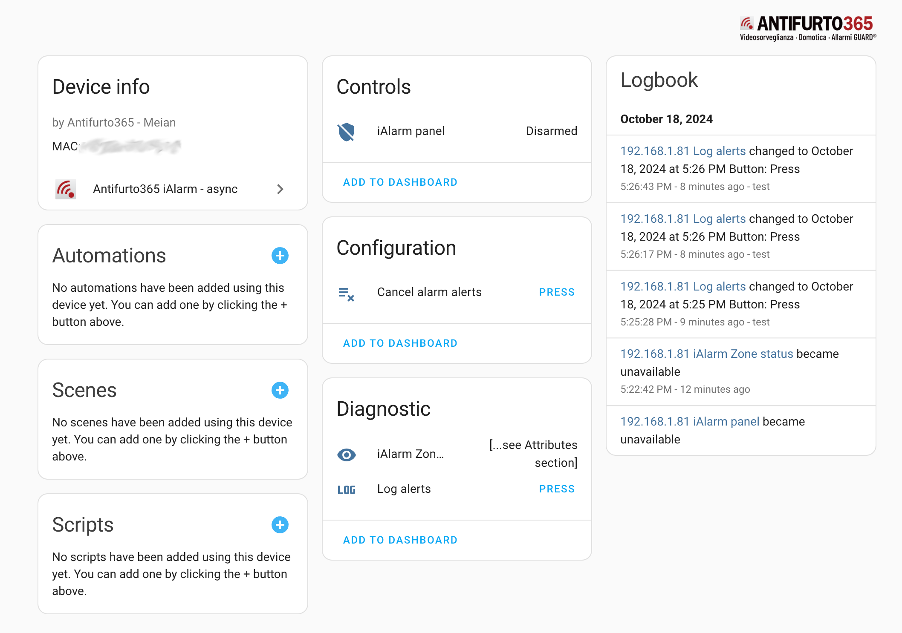
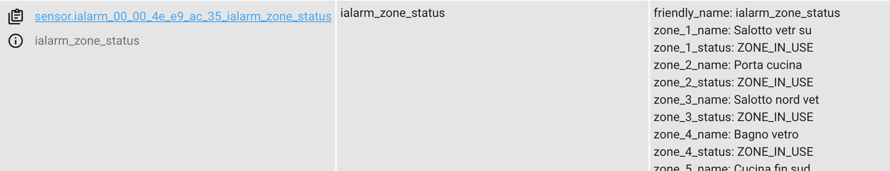
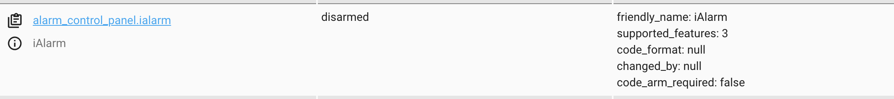
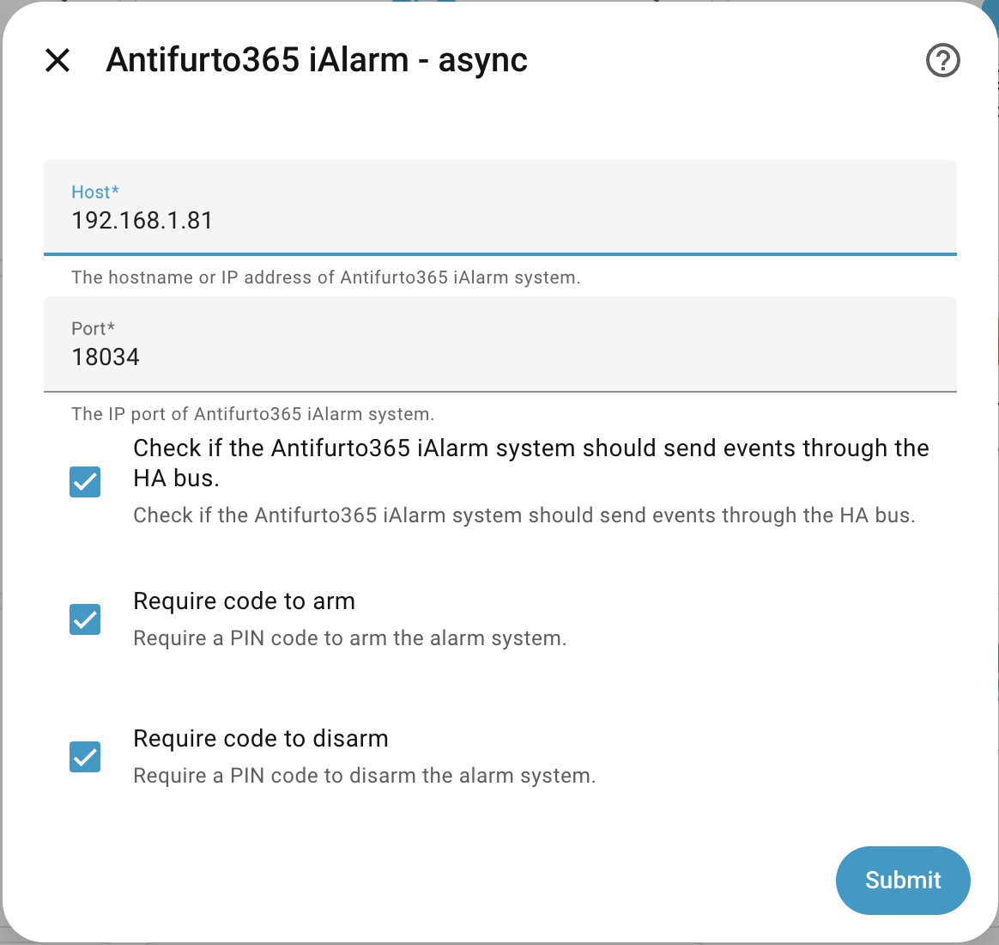

# IAlarm&trade; integration for homeassistant (unofficial)

[![GitHub Release][releases-shield]][releases]
![Project Stage][project-stage-shield]
[![License][license-shield]](LICENSE.md)

![Maintenance][maintenance-shield]
[![GitHub Activity][commits-shield]][commits]

[](https://www.buymeacoffee.com/bigmoby)


This is a platform to support IAlarm under alarm panel component of Home Assistant. The Python supporting library for accessing the IAlarm&trade; API is located at: https://github.com/bigmoby/ialarm_controller/

## Sample UI:





## Installation

### Manual

1. Create this directory path `custom_components/ialarm_controller/` if it does not already exist.

2. Download the all `custom_components/ialarm_controller/` files from the repo and place it in the directory mentioned in previous step.

### HACS

1. Add this repository to HACS:

```
https://github.com/bigmoby/ialarm_controller
```

2. Search for the `IAlarm integration for homeassistant` integration and choose install.

3. Reboot Home Assistant.

## Usage:

In Home Assistant->Settings->Device & services->Integration menu add the new integration IAlarm and configure it.



## UI Configuration

The iAlarm integration requires a code for both arming and disarming actions to ensure intentionality and security.

### Standard Alarm Panel Card

The easiest way to interact with your alarm is by using the standard `alarm-panel` card. Because the integration enforces a code requirement, the keypad will automatically appear.

```yaml
type: alarm-panel
entity: alarm_control_panel.ialarm_panel
states:
  - arm_home
  - arm_away
```

### Custom Button (Quick Arm)

If you want to create a button that arms the system with a specific code without typing it every time, you can use a manual service call:

```yaml
type: button
name: Quick Arm Away
icon: mdi:shield-lock
tap_action:
  action: call-service
  service: alarm_control_panel.alarm_arm_away
  target:
    entity_id: alarm_control_panel.ialarm_panel
  data:
    code: "1234"
```

### Options & Code Configuration

By default, the integration requires a PIN code for arming and disarming for security reasons. You can customize these requirements at any time:

1. In Home Assistant, go to **Settings** -> **Devices & Services** -> **iAlarm**.
2. Click **Configure** on the integration entry.
3. You can toggle:
   - **Send events**: (Default: `True`) Emits custom events on the Home Assistant bus (`ialarm_triggered`, `ialarm_disarm`, etc.).
   - **Require code to arm**: (Default: `True`) Requires a PIN code when arming the alarm.
   - **Require code to disarm**: (Default: `True`) Requires a PIN code when disarming. When enabled, attempting to disarm without a code generates an error and creates a persistent notification in Home Assistant (*"Failed to disarm the alarm system. Please enter the disarm code."*). If your setup does not use a PIN, simply uncheck this option.

## Custom Polling Interval (Advanced)

Home Assistant strongly discourages configuring the integration's scanning frequency (poll interval) directly from the integration's UI to maintain stability and comply with architectural guidelines. The iAlarm integration uses a pre-calibrated default `DEFAULT_SCAN_INTERVAL` (30 seconds).

If you absolutely need to update the alarm status more frequently (or slower) than the default, you can do this safely using standard Home Assistant mechanisms:

1. Go to **Settings** -> **Devices & Services** -> **iAlarm**.
2. Click on the 3 dots (options) next to the integration and select **System Options**.
3. Toggle off **Enable polling for updates** (this stops the default continuous polling).
4. Create an **Automation** in Home Assistant that triggers exactly at your desired custom interval (e.g. `Time pattern` every 10 seconds).
5. In the Action of this automation, call the action **`homeassistant.update_entity`** and pick your `alarm_control_panel.ialarm_panel` entity.

```yaml
alias: "iAlarm Custom Polling (10s)"
trigger:
  - platform: time_pattern
    seconds: "/10"
action:
  - action: homeassistant.update_entity
    target:
      entity_id: alarm_control_panel.ialarm_panel
```

## Notifications & Automations

You can easily set up notifications in Home Assistant to be alerted on your smartphone (via Home Assistant Companion App) or directly in the Home Assistant interface.

### 1. Mobile App Push Notification (Alarm Triggered)

Send an instant notification to your smartphone when the alarm is triggered, with the specific zone name that triggered the alarm:

```yaml
alias: "iAlarm: Notify on Triggered"
description: "Send push notification when a zone in iAlarm triggers an alarm."
triggers:
  - platform: event
    event_type: ialarm_triggered
actions:
  - action: notify.notify  # Or notify.mobile_app_<your_phone_name>
    data:
      title: "🚨 ALARM TRIGGERED!"
      message: "Attention: Zone [{{ trigger.event.data.alarmed_zones[0].name }}] is in alarm!"
      data:
        push:
          sound: "critical"
mode: single
```

### 2. Mobile App Notification on Armed / Disarmed State Changes

Receive a push notification whenever the alarm status changes:

```yaml
alias: "iAlarm: State Change Notification"
description: "Send push notification when iAlarm is armed or disarmed."
triggers:
  - platform: event
    event_type: ialarm_arm_away
    id: armed_away
  - platform: event
    event_type: ialarm_arm_stay
    id: armed_home
  - platform: event
    event_type: ialarm_disarm
    id: disarmed
actions:
  - action: notify.notify
    data:
      title: "iAlarm Status"
      message: >
        
          Alarm is now Armed Away 🛡️
        
          Alarm is now Armed Home 🏠
        
          Alarm has been Disarmed 🔓
        
mode: single
```

### 3. Persistent Notification in Home Assistant Interface

Create a persistent alert in the Home Assistant sidebar / notification center:

```yaml
alias: "iAlarm: Persistent Alert on Trigger"
triggers:
  - platform: event
    event_type: ialarm_triggered
actions:
  - action: persistent_notification.create
    data:
      title: "iAlarm Triggered"
      message: "Zone [{{ trigger.event.data.alarmed_zones[0].name }}] went into alarm at {{ now().strftime('%H:%M:%S') }}."
      notification_id: "ialarm_alert"
mode: single
```

### Native Device Triggers (Via UI)

If you prefer building automations visually in Home Assistant without writing YAML:
1. Go to **Settings** -> **Automations & Scenes** -> **Create Automation**.
2. Click **Add Trigger** and select **Device**.
3. Choose your **iAlarm** device.
4. Select one of the available native triggers:
   - **Alarm system disarmed**
   - **Alarm system armed home** (stay)
   - **Alarm system armed away**
   - **Alarm system triggered**
5. Under **Actions**, click **Add Action** -> **Notifications** -> **Send notification** and select your mobile device or notification target.

## Services

Invoke get iAlarm log service example:

```
action: ialarm_controller.get_log
data:
  max_entries: 25
target:
  device_id: [your-device-id]
```

## Develop

Setup the environment invoking:

```
./scripts/setup
```

and each time you start a new terminal session, you will need to activate your virtual environment:

```
source venv/bin/activate
```

After that you can run Home Assistant like this:

```
./scripts/develop
```

Test your source code (not in Dev Container) with, for example:

```
pytest tests/test_config_flow.py
```

## Known issues and missing features:

-

##

## Contributing

This is an active open-source project. We are always open to people who want to
use the code or contribute to it.

We have set up a separate document containing our
[contribution guidelines](CONTRIBUTING.md).

Thank you for being involved! :heart_eyes:

## Sponsor

Please, if You want support this kind of projects:

<a href="https://www.buymeacoffee.com/bigmoby" target="_blank"></a>

Many Thanks,

Fabio Mauro

## Authors & contributors

Fabio Mauro Bigmoby

\*\* "IAlarm" is a trademark of Antifurto365.

[releases-shield]: https://img.shields.io/github/release/bigmoby/ialarm_controller.svg
[releases]: https://github.com/bigmoby/ialarm_controller/releases
[project-stage-shield]: https://img.shields.io/badge/project%20stage-production%20ready-brightgreen.svg
[license-shield]: https://img.shields.io/github/license/bigmoby/ialarm_controller
[maintenance-shield]: https://img.shields.io/maintenance/yes/2026.svg
[commits-shield]: https://img.shields.io/github/commit-activity/y/bigmoby/ialarm_controller.svg
[commits]: https://img.shields.io/github/commits/bigmoby/ialarm_controller
