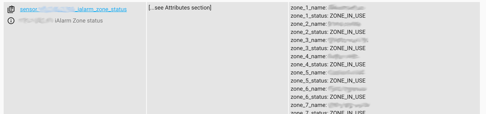
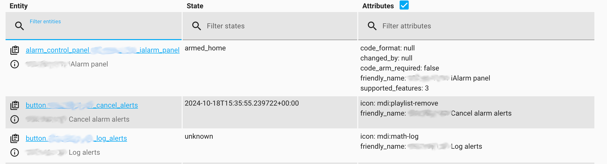
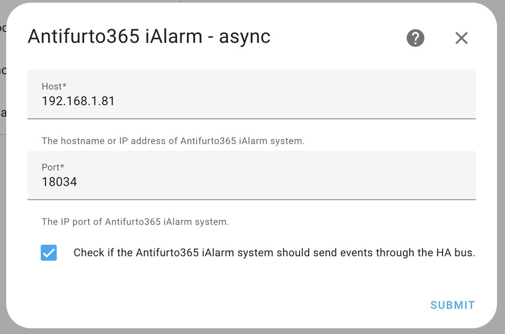

# IAlarm&trade; integration for homeassistant (unofficial)

[![GitHub Release][releases-shield]][releases]
![Project Stage][project-stage-shield]
[![License][license-shield]](LICENSE.md)

![Maintenance][maintenance-shield]
[![GitHub Activity][commits-shield]][commits]

[](https://www.buymeacoffee.com/bigmoby)


This is a platform to support IAlarm under alarm panel component of Home Assistant. The Python supporting library for accessing the IAlarm&trade; API is located at: https://github.com/bigmoby/ialarm_controller/

## Sample UI:





## Installation

### Manual

1. Create this directory path `custom_components/ialarm_controller/` if it does not already exist.

2. Download the all `custom_components/ialarm_controller/` files from the repo and place it in the directory mentioned in previous step.

### HACS

1. Add this repository to HACS:

```
https://github.com/bigmoby/ialarm_controller
```

2. Search for the `IAlarm integration for homeassistant` integration and choose install.

3. Reboot Home Assistant.

## Usage:

In Home Assistant->Settings->Device & services->Integration menu add the new integration IAlarm and configure it.



## Events

With this iAlarm integration will be available these Home Assistant Events: `ialarm_disarm`, `ialarm_arm_stay`, `ialarm_arm_away`, `ialarm_triggered`, `cancel_alarm`, `ialarm_logs`.

## Automations

### Trigger a Notification When iAlarm is Triggered

This automation allows you to send a notification if the iAlarm system is in a triggered state:

```
alias: Alarm Zone Notification
description: "Sends a notification when a zone in iAlarm is triggered."
triggers:
  - platform: event
    event_type: ialarm_triggered
    variables:
      triggered_zone: "{{ trigger.event.data.alarmed_zones[0].name }}"
conditions: []
actions:
  - service: notify.persistent_notification
    data:
      title: "Alarm Triggered"
      message: "Attention: The zone [{{ triggered_zone }}] is in alarm!"
mode: single

```

## Services

Invoke get iAlarm log service example:

```
action: ialarm_controller.get_log
data:
  max_entries: 25
target:
  device_id: [your-device-id]
```

## Develop

Setup the environment invoking:

```
./scripts/setup
```

and each time you start a new terminal session, you will need to activate your virtual environment:

```
source venv/bin/activate
```

After that you can run Home Assistant like this:

```
./scripts/develop
```

Test your source code (not in Dev Container) with, for example:

```
pytest tests/test_config_flow.py
```

## Known issues and missing features:

-

##

\*\* "IAlarm" is a trademark of Antifurto365.

[releases-shield]: https://img.shields.io/github/release/bigmoby/ialarm_controller.svg
[releases]: https://github.com/bigmoby/ialarm_controller/releases
[project-stage-shield]: https://img.shields.io/badge/project%20stage-production%20ready-brightgreen.svg
[license-shield]: https://img.shields.io/github/license/bigmoby/ialarm_controller
[maintenance-shield]: https://img.shields.io/maintenance/yes/2024.svg
[commits-shield]: https://img.shields.io/github/commit-activity/y/bigmoby/ialarm_controller.svg
[commits]: https://img.shields.io/github/commits/bigmoby/ialarm_controller
